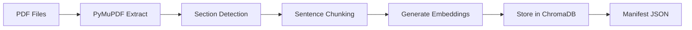

# ⚖️ Indian Legal AI Chatbot

> AI-powered legal assistant for Indian law using **BNS**, **BNSS**, and **BSA** as knowledge base with RAG (Retrieval-Augmented Generation)

[](https://www.python.org/downloads/)
[](https://www.trychroma.com/)
[](https://streamlit.io/)

---

## 📌 Overview

This project builds a **Legal Virtual Lawyer** that answers questions about Indian law using authentic statutory content from:

- **BNS** (Bharatiya Nyaya Sanhita) - Criminal Law
- **BNSS** (Bharatiya Nagarik Suraksha Sanhita) - Criminal Procedure  
- **BSA** (Bharatiya Sakshya Adhiniyam) - Evidence Law

> These three acts replaced the IPC, CrPC, and Indian Evidence Act in 2024.

**Key Features:**
- ✅ Retrieval-Augmented Generation (RAG) for accurate legal citations
- ✅ Sentence-based intelligent chunking for better context
- ✅ ChromaDB vector storage with cosine similarity search
- ✅ HuggingFace LLM integration (Llama 3.2 3B Instruct)
- ✅ Streamlit web interface
- ✅ Source citations with section numbers and page references

---

## 🏗️ Architecture

```
User Query → Embedding → ChromaDB Search → Top-K Retrieval → LLM Reasoning → Answer + Citations
```

**Components:**

1. **Ingestion Pipeline** ([`scripts/ingest_pdfs.py`](scripts/ingest_pdfs.py))
   - Extracts text from PDF statutes using PyMuPDF
   - Detects sections via regex patterns (Section 123, CHAPTER IV, etc.)
   - Chunks text intelligently using sentence tokenization
   - Generates embeddings using `sentence-transformers` (local) or OpenAI
   - Stores vectors in ChromaDB with rich metadata

2. **Retrieval Layer** ([`scripts/Retrieval_function.py`](scripts/Retrieval_function.py))
   - Embeds user queries using same model as ingestion
   - Performs cosine similarity search in ChromaDB
   - Returns top-K relevant statute chunks with metadata
   - Converts distance scores to relevance scores

3. **LLM Reasoning** ([`scripts/main.py`](scripts/main.py))
   - Uses retrieved context to answer questions
   - Calls HuggingFace Router API with Llama 3.2 3B Instruct
   - Ensures grounded responses (answers only from retrieved context)
   - Formats answers with proper legal citations

4. **Web Interface** ([`scripts/app.py`](scripts/app.py))
   - Streamlit chat interface with session management
   - Displays answers with expandable source citations
   - Shows relevance scores and page numbers for each source
   - Real-time streaming of responses

5. **Testing & Validation**
   - **[`scripts/client.py`](scripts/client.py)** - ChromaDB connection testing and retrieval validation
   - **[`scripts/test.py`](scripts/test.py)** - End-to-end query testing with sample legal questions
   - Complex test queries in [`README.md/prompts.txt`](README.md/prompts.txt)

---

## 🚀 Quick Start

### 1. Clone Repository
```bash
git clone <your-repo-url>
cd LEGAL_CHATBOT
```

### 2. Setup Environment
```bash
python -m venv venv
venv\Scripts\activate  # Windows
# source venv/bin/activate  # Linux/Mac

pip install chromadb sentence-transformers streamlit python-dotenv requests pymupdf nltk tqdm numpy
```

### 3. Configure API Keys
Create `.env` file in root directory:
```env
HUGGINGFACE_API_KEY=your_hf_key_here
```

Get your HuggingFace API key from: https://huggingface.co/settings/tokens

### 4. Ingest Legal Documents
Place your PDF files in the `data/` folder (BNS.pdf, BNSS.pdf, BSA.pdf), then run:

```bash
python scripts/ingest_pdfs.py --pdfs data/BNS.pdf data/BNSS.pdf data/BSA.pdf --act_names BNS BNSS BSA --provider local --chroma_path vectorstore --chroma_collection statutes_v1
```

**What happens:**
- Extracts text from PDFs page by page
- Detects section boundaries using regex patterns
- Splits into sentence-based chunks (~400 words each)
- Generates embeddings using `all-MiniLM-L6-v2`
- Stores in ChromaDB at `vectorstore/`
- Creates `scripts/ingest_manifest.json` with ingestion statistics

**Expected output:**
```
📥 Processing BNS.pdf...
  ✓ Extracted 500 pages, 350 sections, 1200 chunks
📥 Processing BNSS.pdf...
  ✓ Extracted 320 pages, 280 sections, 850 chunks
...
✅ Total: 2500 chunks ingested successfully
```

### 5. Test Retrieval (Optional)
```bash
python scripts/client.py
```

Validates ChromaDB connection and tests similarity search.

### 6. Run Chatbot
```bash
streamlit run scripts/app.py
```

Access the chatbot at: **http://localhost:8501**

---

## 📂 Project Structure

```
LEGAL_CHATBOT/
├── data/                       # PDF statutes (BNS, BNSS, BSA)
│   ├── BNS.pdf
│   ├── BNSS.pdf
│   └── BSA.pdf
├── scripts/
│   ├── ingest_pdfs.py          # PDF ingestion & embedding pipeline
│   ├── Retrieval_function.py   # ChromaDB search wrapper
│   ├── main.py                 # LLM reasoning with HuggingFace
│   ├── app.py                  # Streamlit web interface
│   ├── client.py               # ChromaDB testing script
│   ├── test.py                 # Query testing script
│   └── ingest_manifest.json    # Ingestion metadata (auto-generated)
├── vectorstore/                # ChromaDB storage (gitignored)
│   └── chroma.sqlite3
├── README.md/
│   └── prompts.txt             # Sample complex legal queries
├── .env                        # API keys (gitignored)
├── .gitignore
└── README.md                   # This file
```

---

## 🔧 Configuration

### Chunking Parameters
Edit in [`scripts/ingest_pdfs.py`](scripts/ingest_pdfs.py):
```python
MAX_WORDS_PER_CHUNK = 400   # Target words per chunk
MIN_WORDS_PER_CHUNK = 100   # Minimum chunk size
SENTENCE_OVERLAP = 1        # Overlap sentences for context continuity
```

**Why sentence-based chunking?**
- Maintains semantic coherence
- Avoids splitting mid-sentence
- Better retrieval quality for legal text

### Embedding Model
In [`scripts/Retrieval_function.py`](scripts/Retrieval_function.py):
```python
retriever = StatuteRetriever(
    chroma_path="../vectorstore",
    collection_name="statutes_v1",
    model_name="all-MiniLM-L6-v2"  # Fast, accurate, 384-dim
)
```

**Alternative models:**
- `all-mpnet-base-v2` (higher quality, slower)
- `paraphrase-multilingual-MiniLM-L12-v2` (for Hindi support)

### LLM Model
In [`scripts/main.py`](scripts/main.py):
```python
chatbot = LegalChatbot(
    model_name="meta-llama/Llama-3.2-3B-Instruct",
    provider="huggingface"
)
```

**Supported models via HuggingFace Router:**
- `meta-llama/Llama-3.2-3B-Instruct` (default, fast)
- `meta-llama/Llama-3.1-8B-Instruct` (better reasoning)
- `mistralai/Mistral-7B-Instruct-v0.3`

### Retrieval Settings
Adjust `n_results` in search calls:
```python
results = retriever.search(query, n_results=5)  # Top 5 chunks
```

---

## 🧪 Testing

### Test Retrieval Quality
```bash
python scripts/client.py
```

Tests ChromaDB connection and runs sample queries:
```
Searching: provisions for anticipatory bail

1. [BNSS] Section 482
   Score: 0.856
   Text: Any person who has reason to believe...
```

### Test End-to-End Queries
```bash
python scripts/test.py
```

Runs complete pipeline with LLM reasoning. Sample test cases in [`README.md/prompts.txt`](README.md/prompts.txt):
- Cross-act queries (BNS + BNSS + BSA)
- Evidence admissibility scenarios
- Procedural questions
- Complex multi-factor questions

---

## 📊 Ingestion Workflow



**Section Detection Patterns:**
```python
# Primary patterns
r'\bSection\s+(\d+[A-Z]?)\.\s*(.+)'
r'\b(\d+)\.\s+([A-Z][^.]{5,100})\.\s*—'
r'\bCHAPTER\s+([IVXLCDM]+)\s*(.+)'
```

**Smart Chunking Logic:**
1. Split text into sentences using NLTK
2. Group sentences to reach ~400 words
3. Add 1-sentence overlap between chunks
4. Never split mid-sentence
5. Preserve section metadata for each chunk

---

## 🎯 Example Usage

### Python API
```python
from main import LegalChatbot

chatbot = LegalChatbot()

result = chatbot.ask(
    "What are the provisions for anticipatory bail under BNSS?"
)

print(result['answer'])
print(f"\nSources: {len(result['sources'])} sections retrieved")

# Access individual sources
for source in result['sources']:
    print(f"- [{source['act']}] Section {source['section']}")
    print(f"  Relevance: {source['relevance_score']:.2f}")
    print(f"  Pages: {source['page']}")
```

### Web Interface
1. Launch: `streamlit run scripts/app.py`
2. Enter question in chat input
3. View answer with expandable sources
4. Chat history maintained in session

**Example Query:**
> "Can electronic evidence be used to convict someone under BNS?"

**Response includes:**
- Detailed answer grounded in retrieved statutes
- Citations: `[BSA] Section 65B - Electronic Evidence`
- Relevance scores for each source
- Page numbers for manual verification

---

## 🔐 Security & Best Practices

- ✅ API keys stored in `.env` (gitignored)
- ✅ Vector database excluded from version control
- ✅ No hallucination - answers only from retrieved context
- ✅ Includes legal disclaimers in responses
- ✅ Timeout protection for API calls (120s)
- ✅ Error handling for missing dependencies

**Privacy:**
- No user queries are stored
- All processing happens locally except LLM API calls
- ChromaDB runs entirely offline

---

## 📦 Dependencies

Core packages:
```
chromadb                  # Vector database
sentence-transformers     # Local embeddings
streamlit                 # Web UI
python-dotenv            # Environment variables
requests                 # HTTP client for HuggingFace API
pymupdf                  # PDF parsing
nltk                     # Sentence tokenization
tqdm                     # Progress bars
numpy                    # Numerical operations
```

Install all:
```bash
pip install chromadb sentence-transformers streamlit python-dotenv requests pymupdf nltk tqdm numpy
```

---

## 🚦 Roadmap

- [ ] Add legal-agent mode for step-by-step advice workflow
- [ ] Implement user consent mechanism for legal advice
- [ ] Structured fact-intake forms for case details
- [ ] Export chat transcripts (PDF/JSON)
- [ ] Add case law integration (Supreme Court judgments)
- [ ] Multi-language support (Hindi, regional languages)
- [ ] FastAPI backend for production deployment
- [ ] User authentication and session persistence
- [ ] Advanced search filters (by act, section, date)
- [ ] Citation graph visualization

---

## 🤝 Contributing

Contributions welcome! Areas for improvement:

**Data Quality:**
- Better section detection regex for edge cases
- Improved chunking strategies for tables/lists
- Support for amendments and notifications

**Features:**
- Additional legal document support (contracts, agreements)
- Cross-referencing between related sections
- Historical version tracking

**Performance:**
- Query caching for common questions
- Batch processing for ingestion
- Optimized embedding models

**Testing:**
- Evaluation framework for answer quality
- Benchmark dataset of legal Q&A
- Unit tests for each component

---

## 🐛 Troubleshooting

**Issue: "HUGGINGFACE_API_KEY not found"**
```bash
# Create .env file with your API key
echo HUGGINGFACE_API_KEY=your_key_here > .env
```

**Issue: ChromaDB collection not found**
```bash
# Re-run ingestion pipeline
python scripts/ingest_pdfs.py --pdfs data/*.pdf --act_names BNS BNSS BSA
```

**Issue: NLTK punkt tokenizer missing**
```python
import nltk
nltk.download('punkt')
```

**Issue: Streamlit port already in use**
```bash
streamlit run scripts/app.py --server.port 8502
```

---

## 📄 License

MIT License - See LICENSE file for details.

---

## ⚠️ Disclaimer

**This chatbot provides legal information, not legal advice.**

The information provided by this chatbot is for general educational purposes only and should not be construed as legal advice. Always consult a qualified lawyer for specific legal matters. The developers are not responsible for any actions taken based on the information provided by this system.

---

## 📧 Contact

For questions, suggestions, or bug reports:
- Open an issue on GitHub
- Submit a pull request with improvements

---

## 🙏 Acknowledgments

- **HuggingFace** - For providing LLM inference via Router API
- **ChromaDB** - For efficient vector storage and retrieval
- **Streamlit** - For rapid web UI development
- **PyMuPDF** - For reliable PDF text extraction

---

**Built with ❤️ using Python, ChromaDB, HuggingFace, and Streamlit**

*Making Indian legal knowledge accessible to everyone*
